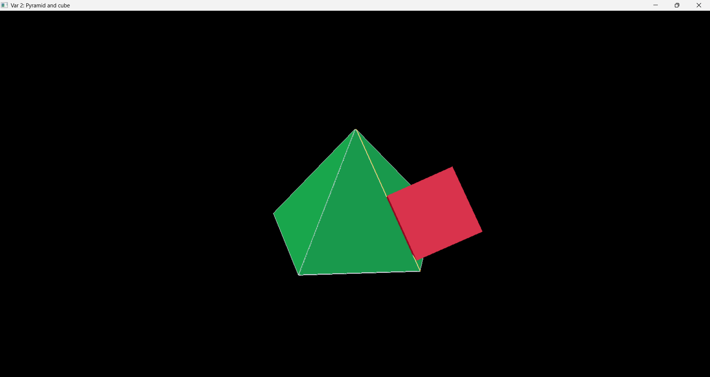
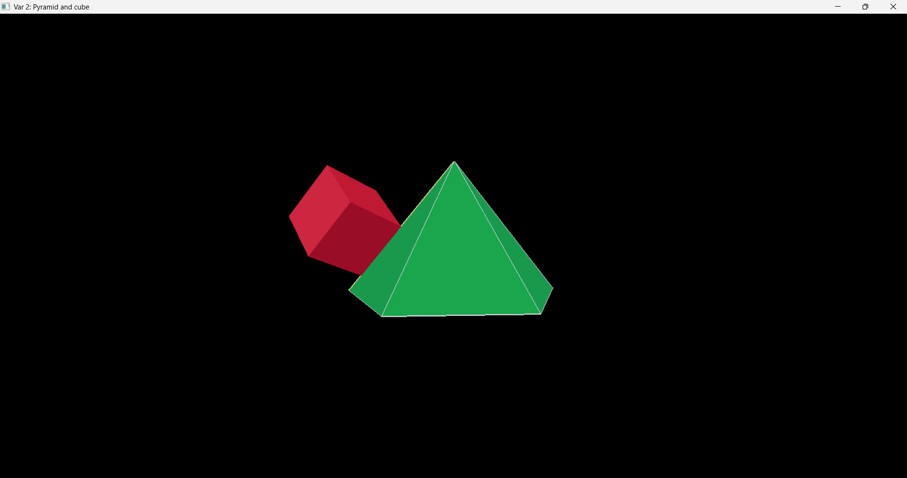
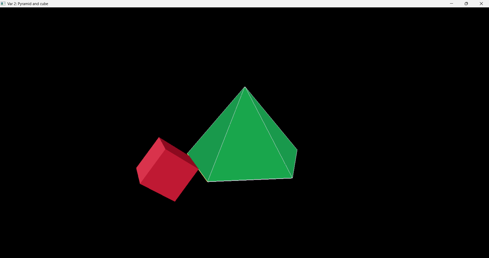

# OpenGL — Пирамида и куб

**Задание:**  
Нарисовать произвольную пирамиду и куб, одно из рёбер которого расположено на ребре пирамиды. По нажатию на левую / правую клавишу мыши выполнять поворот куба относительно ребра пирамиды. По нажатию на клавиши стрелок вверх/вниз - перемещать куб вдоль ребра пирамиды. По нажатию на цифровые клавиши менять у пирамиды ребро, с которым связан куб.

Проект демонстрирует 3D-сцену на **OpenGL (WinAPI + GLU)**: пятиугольная пирамида и куб, у которого одно ребро всегда совпадает с выбранным ребром пирамиды.

## Что реализовано

- Построение правильной пятиугольной пирамиды:
  - 5 рёбер основания;
  - 5 боковых рёбер;
  - итого 10 рёбер, доступных для выбора.
- Отрисовка цветных граней пирамиды и её каркаса.
- Привязка куба к активному ребру пирамиды:
  - ребро куба геометрически выравнивается с ребром пирамиды;
  - куб можно вращать вокруг этого ребра;
  - куб можно сдвигать вдоль ребра.
- Подсветка текущего выбранного ребра.
- Простая 3D-камера с орбитальным управлением мышью.

## Управление

- **ЛКМ / ПКМ** — вращение куба вокруг выбранного ребра пирамиды.
- **↑ / ↓** — перемещение куба вдоль выбранного ребра.
- **Цифры `1..9` и `0`** — выбор ребра пирамиды (`0` = ребро №10).
- **Зажать среднюю кнопку мыши + движение** — вращение камеры вокруг сцены.

## Скриншоты проекта

> Изображения загружаются напрямую из папки [`pics`](./pics).

### Галерея

  
  
  

## Технологии

- C++
- WinAPI
- OpenGL (fixed-function pipeline)
- GLU
- Visual Studio (`.vcxproj`)

## Цель работы

Цель работы — показать преобразования в 3D:

- переход между локальной и мировой системами координат;
- выравнивание объекта по произвольному вектору (ребру);
- композицию трансформаций: перенос → поворот → масштабирование;
- интерактивное управление сценой через клавиатуру и мышь.
